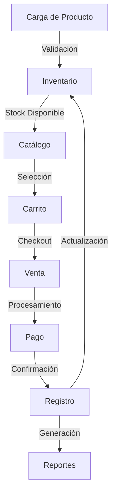

# Especificación de Requisitos de Software (SRS)
# Sistema POS Especializado Karma

## 1. Introducción

### 1.1 Propósito
Este documento describe los requisitos del sistema POS especializado para Karma, una joyería que requiere funcionalidades específicas para la gestión de productos, ventas y pagos.


### 1.2 Alcance
El sistema POS de Karma es una aplicación web que gestiona el proceso de venta de joyería, desde la carga de productos hasta el registro de ventas y generación de reportes, excluyendo módulos tradicionales de POS que no son relevantes para el negocio.
Movil first y dise;o inspirado en vercel. simple 

### 1.3 Exclusiones Específicas
- No incluye gestión de devoluciones
- No maneja impresión de tickets fiscales
- No incluye gestión de proveedores
- No maneja múltiples almacenes
- No incluye sistema de fidelización de clientes

## 2. Descripción General

### 2.1 Perspectiva del Producto
Sistema POS web-based con arquitectura cliente-servidor:
- Frontend: React.js con TailwindCSS
- Backend: Flask (Python) con Supabase
- API RESTful para comunicación

### 2.2 Características de Usuarios
- **Vendedores**: Acceso a ventas y consultas
- **Administradores**: Acceso completo al sistema
- **No requiere**: Cajeros, bodegueros, ni roles adicionales

## 3. Flujos Principales del Sistema

### 3.1 Gestión de Productos
#### 3.1.1 Carga de Productos
- Registro de productos con:
  - Código único (sku)
  - Tipo de Joya (Pulsera, Collar, Aretes, Anillo, Tobillera, Accesorio)
  - Descripción (Opcional)
  - Precio
  - Categoría
  - Stock
  - Color

#### 3.1.2 Sistema de Etiquetado
- Generación de etiquetas:
  - Formatos predefinidos:
    * Pequeño (25x15mm)
    * Mediano (50x25mm)
    * Grande (75x50mm)
  - Elementos configurables:
    * Código QR (vinculado al SKU)
    * Precio
    * Código SKU
    * Tipo de Joya
  - Características:
    * Previsualización en tiempo real
    * Selección múltiple de elementos a mostrar
    * Ajuste de tamaño de elementos
    * Guardado de plantillas personalizadas
  - Impresión:
    * Compatible con impresoras térmicas estándar
    * Ajuste automático según formato
    * Vista previa antes de impresión
  - Integración QR:
    * Generación automática basada en SKU
    * Formato URL para escaneo directo
    * Enlace directo al sistema de carrito

#### 3.1.2 Gestión de Inventario
- Control de stock (todos son productos unicos asi que no requiere minimo para restock)
- Actualización automática post-venta
-Filtrado y ordenamiento de informacion por categorias, stock, busqueda, tipo 

### 3.2 Proceso de Venta
#### 3.2.1 Carrito de Compras
- Métodos de ingreso de productos:
  * Entrada manual por SKU
  * Escaneo de QR mediante dispositivo móvil
  * Selección desde catálogo
- Funcionalidad de escáner QR:
  * Integración nativa con cámara del dispositivo
  * Procesamiento automático del código
  * Validación instantánea del producto
  * Feedback visual y sonoro de escaneo
- Gestión de productos:
  * Modificar cantidades (consultando disponibilidad)
  * Eliminar productos
  * Calcular totales automáticamente
- Características del carrito:
  * Persistencia en base de datos
  * Múltiples carritos simultáneos por vendedor
  * Carrito asignado al vendedor
  * Sincronización en tiempo real

#### 3.2.2 Procesamiento de Pagos
- **Métodos de pago soportados:**
  - Efectivo
  - Tarjeta de crédito/débito
  - Transferencia bancaria
  - Pagos mixtos (combinación de métodos)
- **Características:**
  - Registro de pagos parciales
  - Manejo de pagos divididos
  - Estado de pago (pendiente, parcial, completado)
  *No esta integrado con ningun sistema aparte para la aceptacion de pagos electronicos, solo se registra como punto de venta por parte del vendedor y se anexan los debidos comprobantes en caso de ser necesarios, por lo que la db debe de estar segmentada para capturar correctamente la informacion

#### 3.2.3 Registro de Ventas
- Generación de comprobante (pdf)
- Registro de método de pago
- Asociación con vendedor
- Timestamp de la transacción
- Detalle de productos vendidos

### 3.3 Reportes
#### 3.3.1 Reportes de Ventas
- Ventas diarias
- Ventas por período
- Ventas por producto
- Ventas por método de pago

#### 3.3.2 Reportes de Inventario
- Productos más vendidos
- Productos menos vendidos

## 4. Requisitos Específicos

### 4.1 Requisitos Funcionales
#### RF1: Gestión de Productos y Etiquetado
```json
{
  "id": "RF1",
  "descripción": "Gestión completa de productos y sistema de etiquetado",
  "endpoints": [
    "POST /api/productos",
    "GET /api/productos",
    "PUT /api/productos/{id}",
    "DELETE /api/productos/{id}",
    "POST /api/etiquetas/generar",
    "GET /api/etiquetas/formatos",
    "POST /api/etiquetas/imprimir"
  ],
  "validaciones": [
    "Código único por producto",
    "Precio mayor a cero",
    "Stock no negativo",
    "QR válido y único"
  ],
  "funcionalidades_etiquetas": [
    "Generación de QR vinculado a SKU",
    "Múltiples formatos de impresión",
    "Previsualización en tiempo real",
    "Personalización de elementos visibles"
  ],
  "formatos_soportados": [
    "25x15mm",
    "50x25mm",
    "75x50mm"
  ]
}
```

#### RF2: Gestión de Carrito
```json
{
  "id": "RF2",
  "descripción": "Manejo de carrito de compras",
  "endpoints": [
    "POST /api/carrito",
    "GET /api/carrito",
    "PUT /api/carrito/{id}/cantidad",
    "DELETE /api/carrito/{id}"
  ],
  "características": [
    "Persistencia en base de datos",
    "Múltiples carritos por vendedor",
    "Cálculo automático de totales"
  ]
}
```

#### RF3: Procesamiento de Ventas
```json
{
  "id": "RF3",
  "descripción": "Registro y procesamiento de ventas",
  "endpoints": [
    "POST /api/ventas",
    "GET /api/ventas",
    "GET /api/ventas/{id}"
  ],
  "acciones": [
    "Crear venta desde carrito",
    "Actualizar inventario",
    "Registrar pago",
    "Generar comprobante"
  ]
}
```

#### RF4: Gestión de Pagos
```json
{
  "id": "RF4",
  "descripción": "Procesamiento de pagos",
  "endpoints": [
    "POST /api/pagos",
    "POST /api/pagos/split",
    "GET /api/pagos/venta/{id}"
  ],
  "características": [
    "Múltiples métodos de pago",
    "Pagos parciales",
    "Pagos divididos"
  ]
}
```

### 4.2 Requisitos No Funcionales
#### RNF1: Rendimiento
- Tiempo de respuesta < 2 segundos
- Soporte para 100 usuarios concurrentes
- Procesamiento de 1000 transacciones/hora

#### RNF2: Seguridad
- Autenticación JWT
- HTTPS obligatorio
- Registro de actividades críticas
- Validación de roles y permisos

#### RNF3: Disponibilidad
- Uptime 99.9%
- Backup diario de datos
- Recuperación en menos de 1 hora

#### RNF4: Usabilidad
- Interfaz responsive
- Máximo 3 clics para completar venta
- Soporte para dispositivos táctiles enfocado en movil first 

## 5. Flujo de Datos Principal



## 6. Integraciones

### 6.1 Base de Datos
- Supabase para persistencia de datos
- Tablas principales:
  - productos
  - carrito
  - ventas
  - pagos
  - usuarios

### 6.2 API
- RESTful
- JSON como formato de datos
- Autenticación mediante tokens
- Rate limiting implementado

## 7. Restricciones Técnicas

### 7.1 Frontend
- React 18+
- TailwindCSS para estilos
- Responsive design obligatorio

### 7.2 Backend
- Python 3.9+
- Flask como framework
- Supabase como base de datos

### 7.3 Requisitos Específicos de QR y Etiquetado

#### 7.3.1 Generación de QR
- Biblioteca: qrcode.js o similar
- Formato: URL codificada con SKU
- Densidad: Ajustable según tamaño de etiqueta
- Corrección de errores: Nivel H (30%)

#### 7.3.2 Escáner QR
- API: WebRTC para acceso a cámara
- Biblioteca: zxing.js para decodificación
- Compatibilidad móvil: iOS 11+, Android 6.0+
- Modos de escaneo:
  * Continuo (stream)
  * Único (snapshot)

#### 7.3.3 Sistema de Etiquetado
- Renderizado: HTML5 Canvas / SVG
- Previsualización: PDF.js
- Impresión: 
  * Protocolo: WebPrint / IPP
  * Formatos: ZPL, EPL, ESC/POS
  * Resolución mínima: 203 dpi

## 8. Consideraciones de Implementación

### 8.1 Seguridad
- Validación de inputs
- Sanitización de datos
- Control de acceso por roles
- Protección contra CSRF

### 8.2 Performance
- Caché de productos
- Optimización de queries
- Lazy loading de imágenes
- Minificación de assets

## 9. Métricas de Éxito

### 9.1 Técnicas
- Tiempo de respuesta < 2s
- Uptime > 99.9%
- Cero pérdida de datos

### 9.2 Negocio
- Reducción de tiempo de venta
- Precisión en inventario
- Reportes en tiempo real
